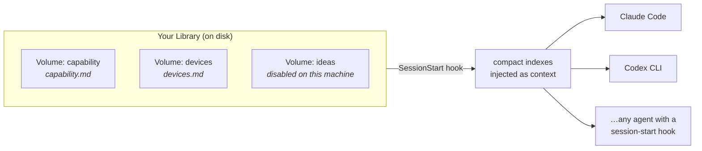

<div align="center">

# AutoLibrary

**Give your coding agent a memory it actually reads — every session, automatically.**

You curate the knowledge once. AutoLibrary loads a compact index of it into the
agent's context at the start of every session, so the agent always knows *what
you know and where to find it* — without you pasting anything, and without
bloating every prompt.

[](LICENSE)


</div>

---

## The problem

Your agent is brilliant and amnesiac. It re-derives things you already wrote
down — your infra quirks, device setup, API playbooks, project decisions —
because it never sees your notes unless it goes digging. The usual fix, dumping
everything into `CLAUDE.md` / `AGENTS.md`, taxes *every* prompt and still goes
stale.

## The idea

Keep your knowledge as normal notes on disk. AutoLibrary injects only a **compact
index** — one terse line per topic — at session start. The agent sees the map;
it reads the territory (full docs) only when a task needs it.



It's **not a plugin for one tool** — it's a knowledge layer for *agents*. Any
agent host with a session-start hook can load the same Library. Claude Code and
Codex CLI ship today; the loader is host-agnostic.

## Why it gets powerful

The magic is extensibility. A **Library** is just a set of **Volumes**, and a
Volume is just a folder with an index. So you can:

- **Grow without limit** — add a Volume by adding one line; it costs nothing until enabled.
- **Shape per machine** — your laptop and your server load different Volumes from the *same* Library.
- **Stay cheap** — the hook fires once per session and the index is prompt-cached; caps bound its size.
- **Keep it yours** — plain Markdown notes, no lock-in, no database.

## Install

### Claude Code

This repo is a plugin **and** its own marketplace:

```
/plugin marketplace add nmhjklnm/auto-library
/plugin install auto-library@auto-library
```

The bundled `SessionStart` hook self-registers — you never touch `settings.json`.
Try it first, no install: `claude --plugin-dir /path/to/auto-library`.

### Codex CLI

Add a `SessionStart` hook to `~/.codex/config.toml` — see
[`codex/README.md`](codex/README.md). Same loader, same config, same behavior.

## Configure

Point AutoLibrary at your Volumes with a JSON config, at any of (first found wins):
`$AUTOLIBRARY_CONFIG`, `$CLAUDE_CONFIG_DIR/autolibrary.json`,
`$CODEX_HOME/autolibrary.json`, or `~/.claude/autolibrary.json`. See
[`autolibrary.example.json`](autolibrary.example.json):

```json
{
  "per_volume_char_cap": 1500,
  "total_char_cap": 8000,
  "volumes": [
    { "name": "capability", "path": "/absolute/path/to/capabilities", "enabled": true },
    { "name": "workspace",  "path": "/absolute/path/to/workspace",    "enabled": false }
  ]
}
```

- Register a Volume by `name` + `path`. Its index file is `<path>/<name>.md` —
  named after the Volume (`workspace` → `workspace.md`), not a generic `INDEX.md`.
- Flip `enabled` to load/unload per machine. Char caps keep the injection small.

## The model: Library ⊃ Volume ⊃ Entry

| Term | What it is | On disk |
|---|---|---|
| **Library** | your whole knowledge set for an agent | — |
| **Volume** | one knowledge domain | a folder, e.g. `capabilities/` |
| **Entry** | one topic in a Volume | a folder, e.g. `capabilities/scholar-search/` |
| **`<name>.md`** | a Volume's compact index, named after it | injected at session start |

Only each Volume's `<name>.md` (one terse line per Entry) enters the context; the
Entries — full docs, assets — stay on disk and are read on demand.

## For agents (self-configuration)

> AutoLibrary is a knowledge-injection tool for coding agents: a session-start
> hook injects each enabled Volume's `<name>.md` index into context. To
> configure it, edit the JSON at `$AUTOLIBRARY_CONFIG`,
> `$CLAUDE_CONFIG_DIR/autolibrary.json`, or `~/.claude/autolibrary.json` —
> `volumes` is a list of `{name, path, enabled}`, and each Volume's index is
> `<path>/<name>.md`. Add a Volume → add an entry; toggle `enabled` per machine.
> The change takes effect on the next session; no restart needed.

An agent can read that one paragraph and configure AutoLibrary with no other docs.

## License

MIT — see [LICENSE](LICENSE).
